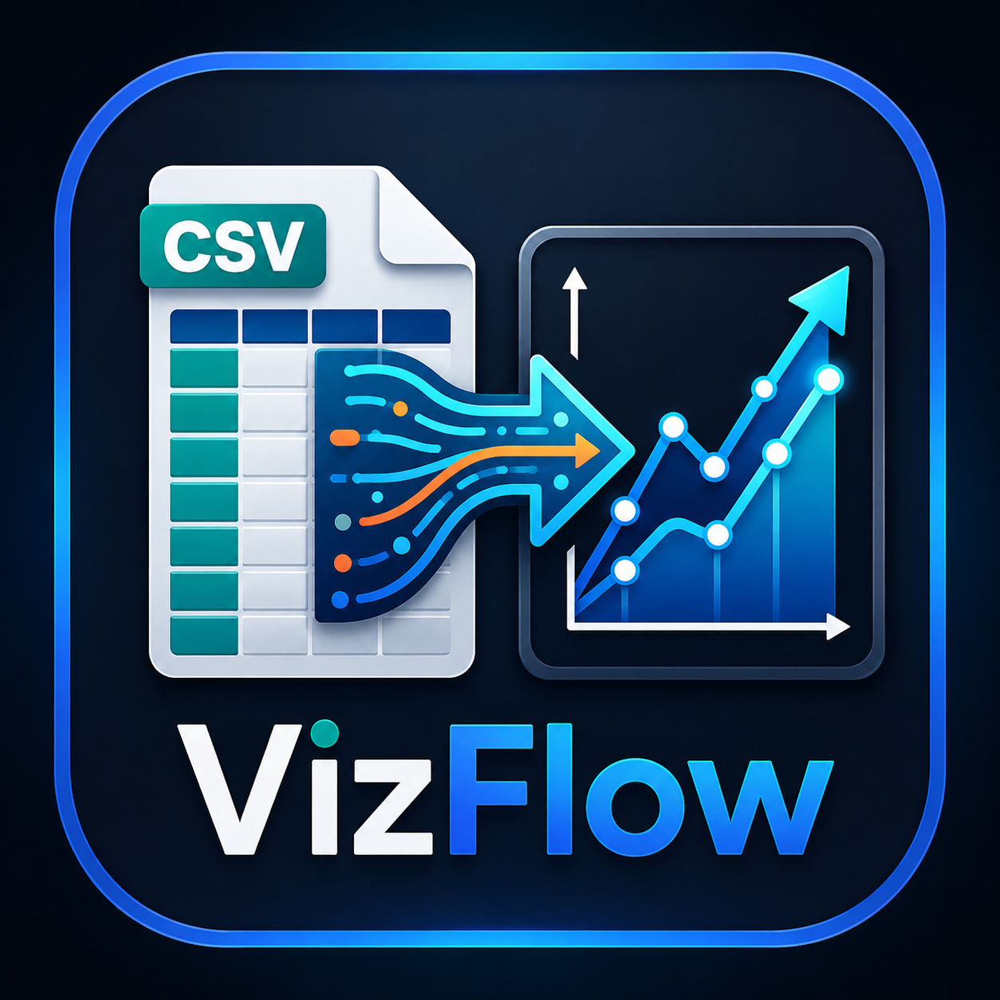

# VizFlow

<div align="center">



**Lightweight • Local-First • Powerful**

[](https://marketplace.visualstudio.com/items?itemName=adoenixes-vizflow.vizflow-studio)
[](https://opensource.org/licenses/MIT)
[](https://github.com/ESAditya1729/VizFlow)

**Explore, transform, and visualize CSV/TSV data without leaving VS Code**

</div>

---

## 🚀 Why VizFlow?

VizFlow brings **data exploration** and **lightweight analytics** directly into your editor. No need to switch contexts, open external tools, or worry about data leaving your machine.

- 📊 **Immediate dataset profiling** — understand your data at a glance
- 🔄 **Visual, repeatable transforms** — preview before applying changes
- 🗄️ **RBQL-powered SQL-like querying** — familiar syntax, instant results
- 📈 **Interactive charts** — bar, line, scatter, and pie visualizations
- 🎯 **Local-first by default** — your data stays on your machine

---

## ✨ Core Features

### 📋 Dataset Profiling
- Column types, null counts, distinct values, top values
- Quick stats: sum, avg, min, max, count

### 🔍 Data Quality Helpers
- Find duplicates in your dataset
- List distinct values for any column

### 🎨 Visual Transformation Studio
- Build queues of transformation rules
- Preview first rows before applying changes
- Apply & save with confidence

### ⚡ RBQL Query Console
- Write SQL-like queries using `a1`, `a2` or header names
- History tracking for reproducible analysis
- Progress indicators for long-running queries

### 📊 Interactive Charts
- Bar charts, line charts, scatter plots, pie charts
- Live mapping with instant updates

### 🔄 CSV Comparison
- Value-based set comparison across two files

### 💾 Exports
- CSV / JSON export
- DuckDB-compatible SQL with `{{INPUT_PATH}}` / `{{OUTPUT_PATH}}` placeholders

---

## 🏃 Quick Start

1. Install **VizFlow** from the VS Code Marketplace
2. Open a CSV/TSV file in the editor
3. Press `Ctrl+Shift+P` (`Cmd+Shift+P` on macOS)
4. Run any `VizFlow:` command, for example: `VizFlow: Dataset Summary Dashboard`

---

## 📝 Commands

| Category | Command |
|----------|---------|
| **Aggregations** | Sum / Average / Min / Max / Count |
| **Profiling & Quality** | Show Statistics, Find Duplicates, List Distinct Values |
| **Transformation** | Transform Column (CLI), Transform Column (Visual) |
| **Analysis** | Dataset Summary Dashboard, Interactive Charts |
| **Comparison** | Compare CSV Files |
| **RBQL** | Run RBQL Queries, Export Results |
| **About** | View Extension Author Info |

---

## 🧠 RBQL Notes

- Use **positional references** (`a1`, `a2`, ...) or enable **Has Header Row** to use header names
- Export results to CSV, JSON, or DuckDB SQL scripts
- Placeholders like `{{INPUT_PATH}}` / `{{OUTPUT_PATH}}` make scripts reproducible

---

## 🔒 Privacy & Offline

VizFlow runs **locally by default** — parsing, transforms, and queries are performed on your machine. Any cloud or AI features would be **opt-in** and clearly indicated.

---

## 📚 Documentation

- **Architecture & Implementation**: See [ARCHITECTURE.md](./ARCHITECTURE.md)
- **Full Documentation**: Coming soon!

---

## 🔧 Installation

### From VS Code Marketplace
Search **VizFlow** in the Extensions view and install.

### From Source
```bash
git clone https://github.com/ESAditya1729/VizFlow.git
cd VizFlow
npm install
# Press F5 in VS Code to launch the Extension Development Host
```

## 🛠️ Development

Run these locally during development:

```bash
npm install          # Install dependencies
npm run lint         # Run linter
npm test             # Run tests
```

## 🤝 Support & Links

- **GitHub**: [ESAditya1729/VizFlow](https://github.com/ESAditya1729/VizFlow)
- **Creator**: Aditya Mukherjee (IBM)
- **LinkedIn**: [Aditya Mukherjee](https://www.linkedin.com/in/aditya-mukherjee-b15428239/)

---

## 📄 License

MIT — see [LICENSE](./LICENSE)

---

<div align="center">

**Built with ❤️ by Aditya Mukherjee · IBM**

</div>